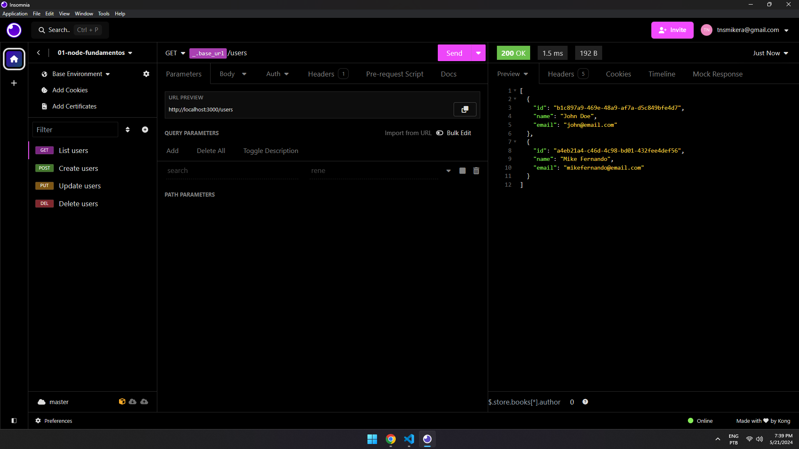

# CRUD 💚 | just nodejs without framework

<p align="left">
    <p align="left" >
        
        </a>
    </p>
</p>

## 📚 Project information.

- I developed this API with the purpose of deepening my knowledge about the internal workings of microframeworks such as "Express" and "Fastify", among others. This understanding enhances my development process, helping to increase our productivity as developers.
&nbsp;

## 💻 What's in the project?

- List users or with filters
- Create users 
- Update users
- Delete users

&nbsp;

## 🛠️ Technologies/Tools used
- [Node.js](https://nodejs.org/en)

&nbsp;

## 💻 How to use the project

To generate a copy of the project and implement its improvements, be on a computer with Node.js installed and follow the steps below:

1 clone o project

```
git clone https://github.com/MikeFernando/Rest-Api-Node-Without-Framework.git
```

2 Access the project folder through the terminal with the command

```
cd Rest-Api-Node-Without-Framework
```

3 Install necessary dependencies with the command

```
npm install
```

4 Run the project with the command

```
npm run dev
```
